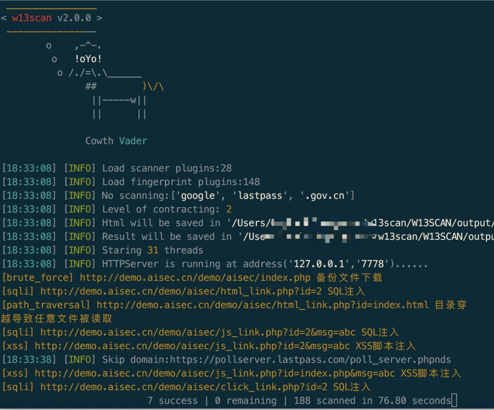

<h1 align="center">W13Scan</h1>

> W13scan 是基于Python3的一款开源的Web漏洞发现工具,它支持主动扫描模式和被动扫描模式，能运行在Windows、Linux、Mac上。

[](https://github.com/boy-hack/w13scan/issues)  [](https://github.com/boy-hack/w13scan/stargazers) [](https://github.com/boy-hack/w13scan/network) [](https://github.com/boy-hack/w13scan/blob/master/LICENSE)



## 声明

使用W13Scan前请遵守当地法律,W13Scan仅提供给授权的渗透测试以及教育行为使用。

## 特点
相比于其他专业的扫描工具，w13scan也有自己独有的优点。
### 免费/开源
安全从业人员可能不会信任任何程序，唯一能让人稍微信任的就是开源代码。

安全是建立在信任之上，信任需要开放和透明。w13scan核心代码完全开源，任何人可以检查其代码的安全性。

可以方便针对一些棘手且高度专业化的环境，可以按照w13scan开发文档补充其功能，自定义需要的模块。

### 丰富的检测插件
- [x] XSS扫描
    - 基于语义的反射型XSS扫描，准确率极高
    - XSS扫描会从网页中提取参数进行解析
- [x] jsonp信息泄漏
    - 基于语义解析寻找敏感信息
- [x] sql注入
    - 基于报错SQL注入检测
    - 基于网页相似度布尔类型的SQL注入检测
    - 基于时间的SQL注入检测
- [x] http smuggling 走私攻击
- [x] Fastjson检测与利用
- [x] .Net通杀Xss检测
    - portswigger 2019十大攻击技术第六名
- [x] iis解析漏洞
- [x] 敏感文件信息泄漏
    - 支持含备份文件，debug文件，js敏感信息,php真实路径泄漏,仓库泄漏，phpinfo泄漏，目录遍历等
- [x] baseline检测(反序列化参数检测)
- [x] 命令/代码注入检测
    - 支持asp,php等语言的检测
    - 支持系统命令注入检测(支持无回显检测)
    - 支持get,post,cookie等方式检测
- [x] 路径穿越漏洞
- [x] struts2漏洞检测
    - 包括s2-016、s2-032、s2-045漏洞
- [x] webpack打包源文件泄漏
### 扫描平台对比
w13scan测试了多个扫描平台，以下为扫描平台的测试报告

| 平台名称                                              | 扫描结果                                                     | 扫描模式                   |
| ----------------------------------------------------- | ------------------------------------------------------------ | -------------------------- |
| [WVS PHP Vulnweb](http://testphp.vulnweb.com/)        | [查看](https://i.hacking8.com/static/testphp.vulnweb.html)   | crawlergo+w13scan 自动扫描 |
| [WVS AJAX Vulnweb](http://testphp.vulnweb.com/AJAX/#) | [查看](https://i.hacking8.com/static/testphp.vulnweb-ajax.html) | 被动扫描                   |
| [demo.aisec.cn](http://demo.aisec.cn/demo/aisec/)     | [查看](https://i.hacking8.com/static/demo.aisec.cn.html)     | 被动扫描                   |


### 扫描细节的处理
w13scan的在一些扫描细节处理
- 支持扫描在 Get,Post,Cookie,Uri(伪静态) 上检测
- w13scan内置第三方`dnslog.cn`反连平台(默认开启)，也内置有自己的反连平台(默认不开启，需配置)，用于检测无回显漏洞。
- w13scan会记录发包过程及详情，并推荐可能的测试方案。
    - 有时候漏洞检测无法知道是否是漏扫插件的误报还是程序本身有问题，w13scan会详细说明扫描到的漏洞是怎么被发现的，以及一些判定过程。
- 在扫描过程中会进行简单的信息收集，如收集`网站框架`，`操作系统`，`编程语言`,`web中间件`等信息，后续的检测中会根据信息收集的程度构造payload，信息收集插件在`fingprints`目录。
- 扫描器在扫描XSS时会通过`html与js的语义化分析`自动从网页中寻找更多参数用于测试,以及根据wooyun漏洞库top参数合并，并根据算法只保留动态的参数进行测试。
- w13scan会实时将结果以json的格式写入到output目录下,开启`--html`后，会实时生成精美的html格式的漏洞报告。
- level发包等级，从1~5，会发送越来越多的数据包
    - 1 发送简单的检测数据包
    - 2 无视指纹识别的环境进行插件扫描(部分插件需要指纹识别到环境才会进行扫描)
    - 3 带上cookie扫描
    - 4 对uri进行探测(分离url，可探测伪静态情况)
    - 5 针对所有情况发送请求包

## 使用

### 安装
安装w13scan需要依赖Python3.6以上环境.
```bash
git clone https://github.com/w-digital-scanner/w13scan.git
pip3 install -r requirements.txt
cd W13SCAN
python3 w13scan.py -h
```
### 被动扫描

```
python3 w13scan.py -s 127.0.0.1:8887 --html # 端口可省略，默认为8887,开启--html即实时生成html报告
```

#### HTTPS支持

如果想让w13scan被动模式支持https，先启动w13scan

```
python3 w13scan.py -s 127.0.0.1:8887 --html
```

在浏览器中访问 http://w13scan.ca 下载证书并信任它。
### 主动扫描

```
-u     输入一个url进行扫描
--file 从文件中读取url扫描
```

w13scan会对url进行参数分析并使用插件扫描，但不会进行爬虫。

### 结合动态爬虫扫描

#### crawlergo + w13scan 自动扫描
在目录`crawlergo_example` `spider.py`展示了如何与crawlergo爬虫结合联动。

### 反连平台(非必须)
修改`config.py`下有关反连平台的设置,可类似修改为
```python
# REVERSE
USE_REVERSE = True  # 使用反连平台将False改为True
REVERSE_HTTP_IP = "127.0.0.1"  # 回连http IP地址，需要改为服务器ip，不能改为0.0.0.0，因为程序无法识别
REVERSE_HTTP_PORT = 9999  # 回连http端口

REVERSE_DNS = "dnslog.w13scan.hacking8.com" # 修改为自己的域名，并将域名dns修改为本机IP

REVERSE_RMI_IP = "127.0.0.1"  # Java RMI 回连IP,需要改为服务器ip，不能改为0.0.0.0，因为程序无法识别
REVERSE_RMI_PORT = 10002  # Java RMI 回连端口

REVERSE_SLEEP = 5  # 反连后延时检测时间，单位是(秒)
```
之后启动反连平
```bash
python3 reverse.py
```
在启动w13scan即可
## 集成到自己扫描器

w13scan是开源的，我们也希望安全研究人员将w13scan集成到自己的扫描器中。

请点击 [开发文档](./doc/dev.md)
## 贡献&感谢
- [CONTRIBUTORS](CONTRIBUTORS.md)
